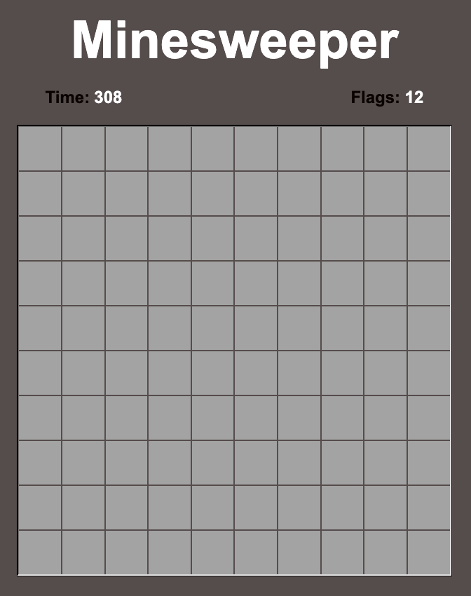
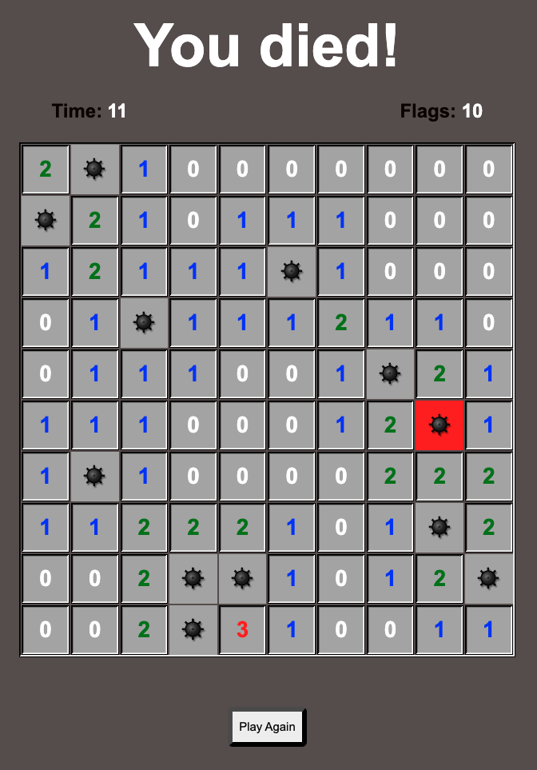

# Minesweeper

My game is Minesweeper, a game that challenges your logic and deduction skills. The game is played on a grid of cells, where some cells contain hidden bombs. The objective is to reveal all cells that are safe (not containing bombs) while avoiding the bombs. When a cell that is not a bomb is revevealed it will show a number from 0 to 8, the number being the amount of bombs next to the cell. Through logic you can calculate where the mines are at, and then flag them by right-clicking. If you reveal a cell with a bomb, the game is over.

## Technologies Used

- `index.html`: The main HTML file for the game.
- `main.css`: The CSS file for styling the game interface.
- `main.js`: The JavaScript file containing the game logic.

## Screenshots
#### Game at start.

#### Game after losing.

## Getting Started

- Clone or download this repository.
- Direct link to game: https://felix-carela-minesweeper.netlify.app/

### Game Controls

- **Left-click:** Reveal a cell.
- **Right-click:** Place a flag (or remove it) on a cell.

## Next Steps

Here are some possible enhancements for this Minesweeper game:

- Add different difficulty levels.
- Implement a win streak counter.
- Improve the visual design and user experience.